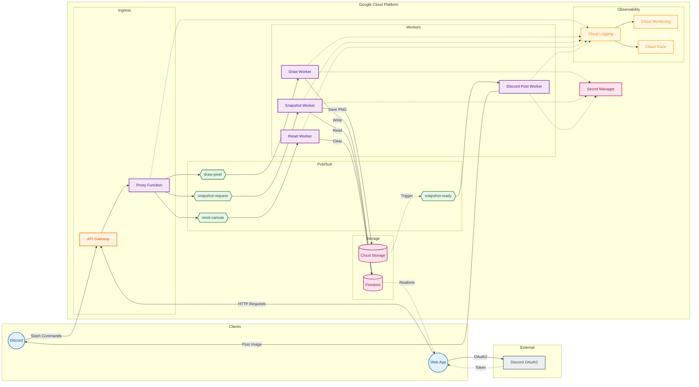

# Architecture Diagram

```mermaid
graph LR
    classDef client fill:#e3f2fd,stroke:#1565c0,stroke-width:2px,color:#0d47a1
    classDef gateway fill:#fff3e0,stroke:#ef6c00,stroke-width:2px,color:#e65100
    classDef function fill:#f3e5f5,stroke:#7b1fa2,stroke-width:2px,color:#4a148c
    classDef topic fill:#e8f5e9,stroke:#2e7d32,stroke-width:2px,color:#1b5e20
    classDef storage fill:#fce4ec,stroke:#c2185b,stroke-width:2px,color:#880e4f
    classDef external fill:#eceff1,stroke:#546e7a,stroke-width:2px,color:#37474f
    classDef monitoring fill:#fff8e1,stroke:#f9a825,stroke-width:2px,color:#f57f17

    subgraph Clients
        Discord(("Discord")):::client
        Web(("Web App")):::client
    end

    subgraph External
        OAuth["Discord OAuth2"]:::external
    end

    subgraph GCP ["Google Cloud Platform"]
        subgraph Ingress
            GW["API Gateway"]:::gateway
            Proxy["Proxy Function"]:::function
        end

        subgraph EventBus ["Pub/Sub"]
            T_Draw{{"draw-pixel"}}:::topic
            T_Snap{{"snapshot-request"}}:::topic
            T_Reset{{"reset-canvas"}}:::topic
            T_Ready{{"snapshot-ready"}}:::topic
        end

        subgraph Workers
            W_Draw["Draw Worker"]:::function
            W_Snap["Snapshot Worker"]:::function
            W_Reset["Reset Worker"]:::function
            W_Post["Discord Post Worker"]:::function
        end

        subgraph Storage
            DB[("Firestore")]:::storage
            Bucket[("Cloud Storage")]:::storage
        end

        subgraph Observability
            Logging["Cloud Logging"]:::monitoring
            Monitoring["Cloud Monitoring"]:::monitoring
            Trace["Cloud Trace"]:::monitoring
        end

        Secrets["Secret Manager"]:::storage
    end

    Web -->|OAuth2| OAuth
    OAuth -.->|Token| Web

    Discord -->|Slash Commands| GW
    Web -->|HTTP Requests| GW
    GW --> Proxy

    Proxy --> T_Draw
    Proxy --> T_Snap
    Proxy --> T_Reset

    T_Draw --> W_Draw
    T_Snap --> W_Snap
    T_Reset --> W_Reset
    T_Ready --> W_Post

    W_Draw -->|Write| DB
    W_Snap -->|Read| DB
    W_Snap -->|Save PNG| Bucket
    W_Reset -->|Clear| DB
    W_Post -->|Post Image| Discord

    Bucket -.->|Trigger| T_Ready
    DB -.->|Realtime| Web

    W_Draw -.-> Secrets
    W_Snap -.-> Secrets
    W_Post -.-> Secrets

    Proxy -.-> Logging
    W_Draw -.-> Logging
    W_Snap -.-> Logging
    W_Reset -.-> Logging
    W_Post -.-> Logging
    Logging --> Monitoring
    Logging --> Trace
```
