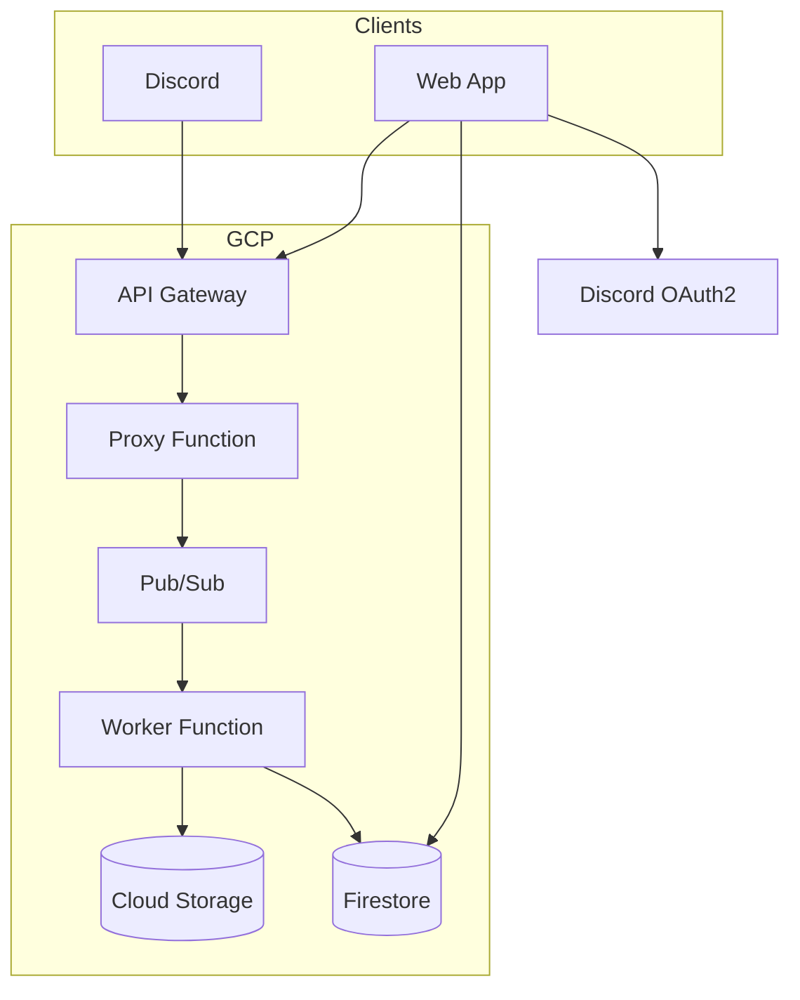

# Architecture Diagram

```mermaid
graph TB
    subgraph GCP
        API[API Gateway]
        PROXY[Proxy Function]
        PUBSUB[Pub/Sub]
        WORKER[Worker Function]
        FIRESTORE[(Firestore)]
        STORAGE[(Cloud Storage)]
    end
    subgraph Clients
        DISCORD[Discord]
        WEB[Web App]
    end

    WEB --> DISCORD_OAUTH[Discord OAuth2]
    WEB --> FIRESTORE
    WEB --> API
    DISCORD --> API
    API --> PROXY
    PROXY --> PUBSUB
    PUBSUB --> WORKER
    WORKER --> FIRESTORE
    WORKER --> STORAGE
```
