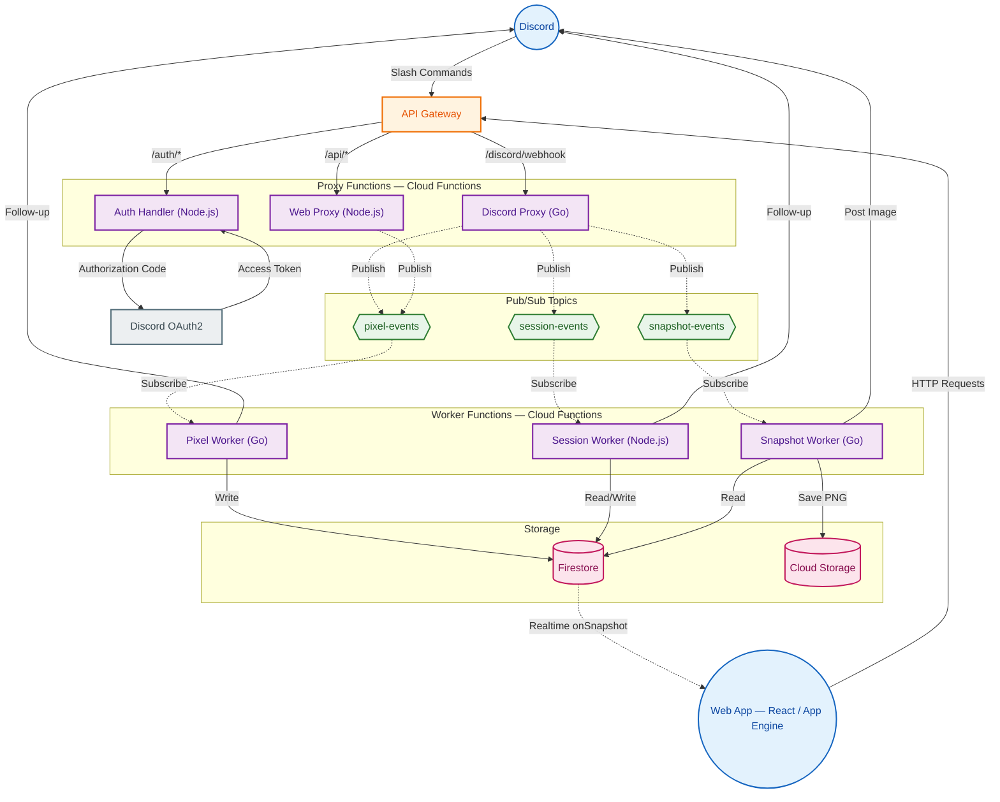
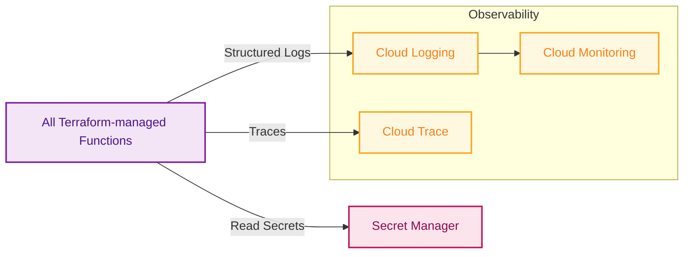

# Architecture Diagram

> **Level:** C4 Container Diagram — shows the deployed units and their interactions.

**Legend:**
| Symbol | Meaning |
|---|---|
| Solid arrow `→` | Synchronous request (HTTP) |
| Dashed arrow `⇢` | Asynchronous message (Pub/Sub, Firestore listener) |
| Circle | External client |
| Rectangle | Cloud Function |
| Hexagon | Pub/Sub topic |
| Cylinder | Data store |
